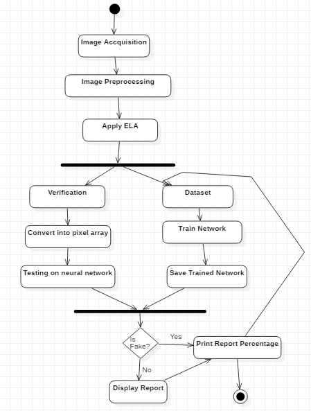
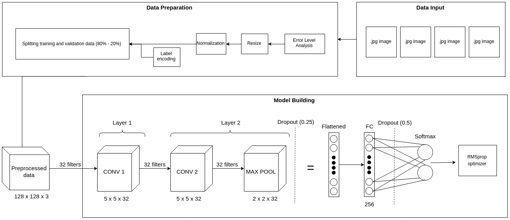

# Image Forgery Detection with ELA and Deep Learning

## Project objective
Combine the implementation of error-level analysis (ELA) and deep learning to detect whether an image has undergone fabrication or/and editing process or not, e.g. splicing.

## Methods
1. Error-level analysis
2. Convolutional neural networks (CNN)
---
## Activity Diagram 

---
## Architecture

## Result
- Convergence: Epoch 30
- Best accuracy: 98.13% (epoch 30)

